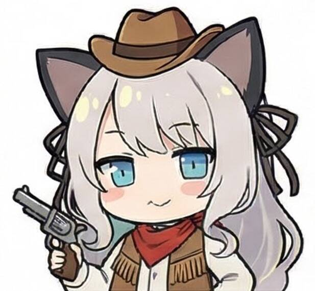

# Bullet-Dodge (PettingZoo + PPO)

<p align="center">
  <a href="mint_cowboy.jpg">
    
  </a>
</p>


基于Gymnasium + PettingZoo构建的基于PPO-Clip的强化学习小游戏代码，小游戏原型是DollWeekend 13上的“天选之娃”游戏，当时就觉得好像是个强化学习任务→_→
## 关于最新版本
最新版本可以去Multiplayer文件夹运行，查看该文件夹下的README，可以进行多人对战（PVP/PVE/PVPVE），非常建议开启
```bash
--bot_sample
```
## 安装
```bash
pip install pettingzoo gymnasium numpy torch
# 或者（推荐，因为要安装CUDA版本的torch）
pip install -r requirements.txt
```

## 文件
- `game.py`：核心规则
- `bullet_dodge_pz.py`：PettingZoo ParallelEnv（同步同时行动 + action_mask + 奖励塑形）
- `train_ppo_pz.py`：独立 PPO-Clip（每个 player 一个网络）
- `play_pz.py`：加载 checkpoint 对战/试玩

## 训练
```bash
python train_ppo_pz.py --num_players 6 --steps 500000 --device cpu
# 或 cuda
python train_ppo_pz.py --num_players 6 --steps 500000 --device cuda
```

## 试玩
```bash
python play_pz.py --num_players 6 --ckpt_dir runs_pz/20260105_110822 --episodes 3 --render
```

## 备注：为什么“每个玩家一个网络”
对抗博弈里如果所有玩家共享同一个网络并且共同优化，很容易变成“合作最大化总回报”，不符合各自为战的策略。
独立 PPO 是一个可跑基线；考虑下一步做 league/policy-pool（对手混合历史快照）。

